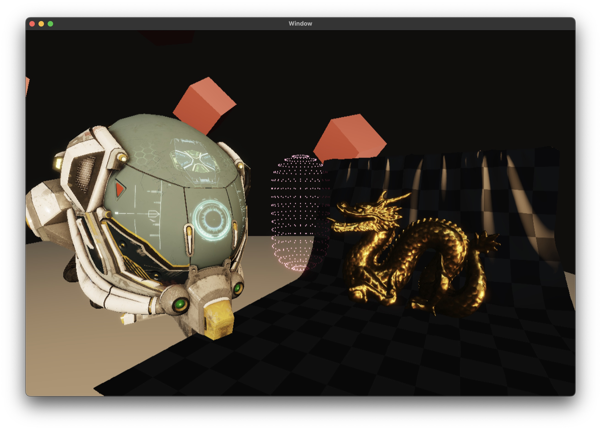
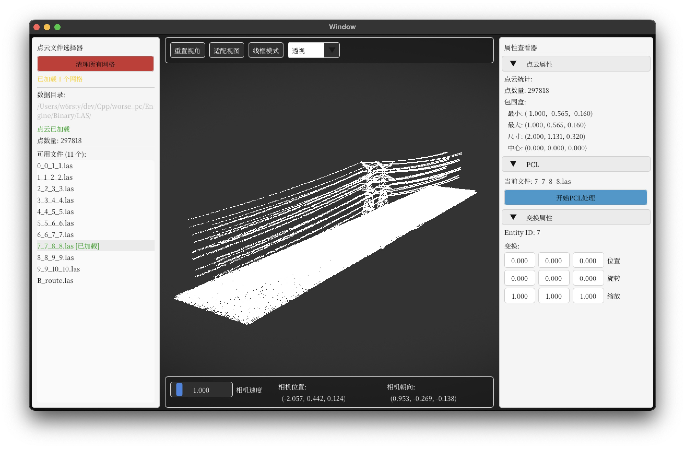

# Worse Engine

An experimental game engine for exploring rendering engine architecture, graphics. Built with modern C++, currently focused on rendering capabilities.

## Preview




Build this Target **Example00**

> `clang_rt.asan_dynamic-x86_64.dll` in WindowSDK is needed if build for Windows

### Features
- Metallic-Roughness 材质系统
- PBR
- glTF 加载
- 点图元绘制模式
- ImGui 路由管理器
- 后处理滤镜( Vignette, Kuwahara Filtering, ACES)

## Point Cloud Editor

 see [`point_cloud_process`](https://github.com/w6rsty/worse/tree/point_cloud_process) branch



# Features

## Rendering

### PSO driven pipeline

```cpp
RHIPipelineStateBuilder()
    .setName("PBRPass")
    .setType(RHIPipelineType::Graphics)
    .setPrimitiveTopology(RHIPrimitiveTopology::TriangleList)
    .setRasterizerState(Renderer::getRasterizerState(RendererRasterizerState::Solid))
    .setDepthStencilState(Renderer::getDepthStencilState(RendererDepthStencilState::ReadWrite))
    .setBlendState(Renderer::getBlendState(RendererBlendState::Off))
    .addShader(Renderer::getShader(RendererShader::PBRV))
    .addShader(Renderer::getShader(RendererShader::PBRP))
    .setRenderTargetColorTexture(0, Renderer::getRenderTarget(RendererTarget::Render))
    .setRenderTargetDepthTexture(Renderer::getRenderTarget(RendererTarget::Depth))
    .setScissor({0, 0, 1200, 720})
    .setViewport(Renderer::getViewport())
    .setClearColor(Color{0.2f, 0.2f, 0.2f, 1.0f})
    .setClearDepth(0.0f)
    .build();
```

## ECS

Bevy-like API

### Swap an entity

```cpp
commands.spawn(
    LocalTransform{
        .position = math::Vector3{5.0f, 0.0f, 0.0f},
        .scale = math::Vector3{10.0f, 0.1f, 10.0f}

        
    },
    Mesh3D{meshes.add(Quad3D{})},
    MeshMaterial{materials->add(StandardMaterial{
        .albedoTexture           = assetServer->submitLoading("albedo.png"),
        .roughnessTexture        = assetServer->submitLoading("roughness.png"),
        .ambientOcclusionTexture = assetServer->submitLoading("ao.png"),
    })}
);
```

### Register systems

```cpp
void update(
    ecs::Commands commands,
    ecs::QueryView<LocalTransform> view,
    ecs::Resource<GlobalContext> globalContext,
    ecs::Resource<Camera> camera
)
{
    static profiling::Stopwatch frameTimer;
    globalContext->deltaTime = frameTimer.elapsedSec();
    globalContext->time += globalContext->deltaTime;
    frameTimer.reset();
}

schedule.addSystem<ecs::CoreStage::Update, update>();
schedule.addSystem<ecs::CoreStage::Update, [](ecs::Commands commands {
    // ....
})>();
```

### ImGui page router


#### Create page state enum
```cpp
enum class PageState
{
    Undefined,
    Begin,
    Game,
    End
};
```

#### Page definition

```cpp
void beginPage(
    ecs::Commands commands,
    ecs::Resource<GlobalContext> globalContext,
    ecs::Resource<PageRounter<PageState>> router
)
{
    if (ImGui::Button("Start Game"))
    {
        router->transfer(PageState::Game);
    }
}

void gamePage(
    ecs::Commands commands,
    ecs::Resource<GlobalContext> globalContext,
    ecs::Resource<PageRounter<PageState>> router
)
{
    if (ImGui::Button("End Game"))
    {
        router->transfer(PageState::End);
    }
}

void endPage(
    ecs::Commands commands,
    ecs::Resource<GlobalContext> globalContext,
    ecs::Resource<PageRounter<PageState>> router
)
{
    if (ImGui::Button("Restart"))
    {
        router->transfer(PageState::Begin);
    }
    if (ImGui::Button("Exit"))
    {
        Window::close();
    }
}
```

#### Register pages

```cpp
void initialize(ecs::Commands commands)
{
    PageRounter<PageState>& router = ImGuiRenderer::registerStates<PageState>(commands, PageState::Begin);

    router->registerPage(PageState::Begin, beginPage);
    router->registerPage(PageState::Game, gamePage);
    router->registerPage(PageState::End, endPage);
}
```

## Bindless textures

```hlsl
(Set 0, Binding 0  ) FrameConstant Data Bind once globally
(Set 0, Binding 1  ) SamplerComparisonState samplerCompareDepth
(Set 0, Binding 2  ) SamplerState samplers[8]
(Set 0, Binding 3  ) Texture2D materialTextures[]

(Set 1, Binding 0-N) Specific
```

## Coordinate System

Right-Handed, +Y UP

Use Reversed-Z (near=1, far=0)